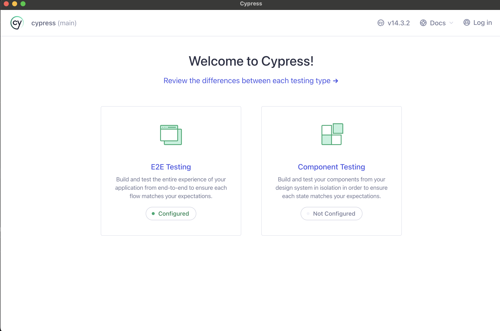
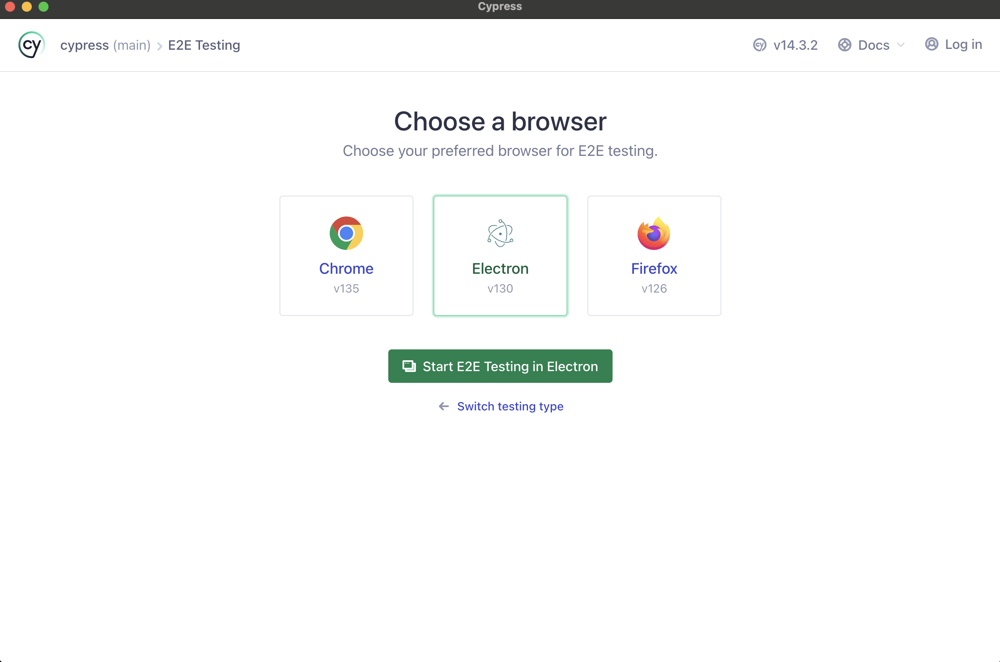
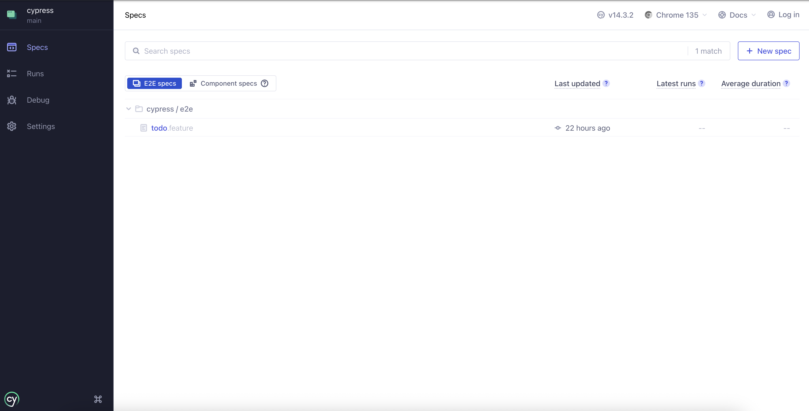
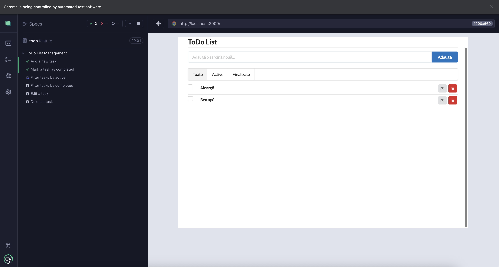
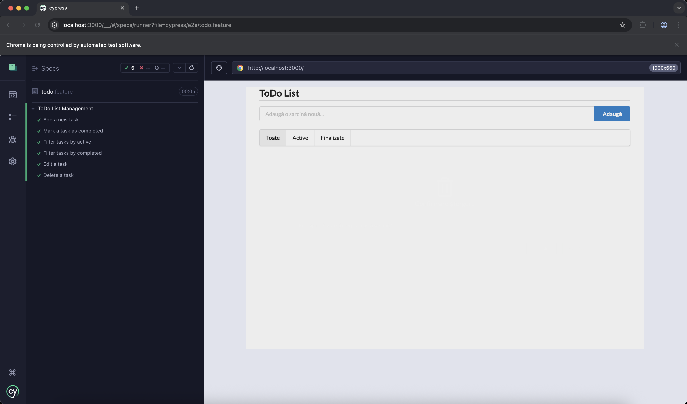
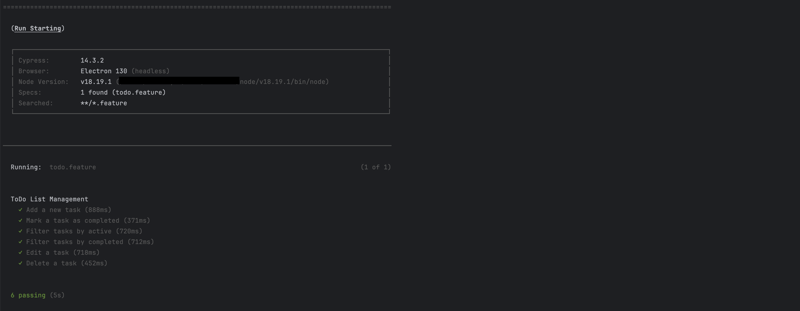
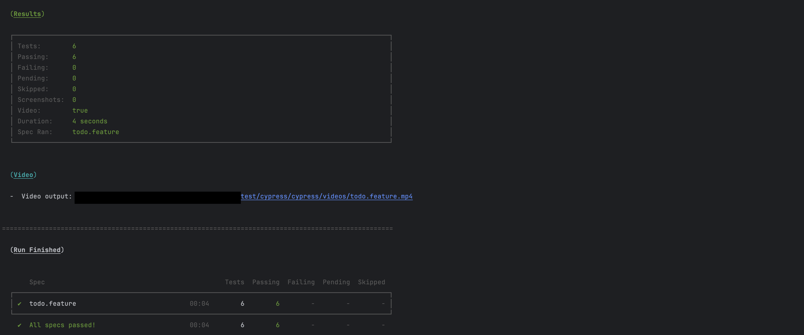

## T6: Testarea interfeței grafice a unei aplicații web

### Autor: Nicolae Pleșco

### Cerințe

- Să se realizeze un studiu comparativ a cel puţin 2 framework-uri de testare, evidențiindu-se
utilitatea şi ușurința în folosire a fiecăruia. Pe baza unor exemple de cod, se vor evidenția
diferențele dintre tool-uri.
- Folosiți un framework pentru a realiza teste ale interfeței grafice a unei aplicații web (teste
de funcționalitate, navigare, validare formular, compatibilitate browser et al.). Motivați alegerea
făcută.

---

### 1. Introducere

Testarea interfeței grafice (GUI) este esențială pentru asigurarea calității aplicațiilor web, deoarece interfața 
este primul punct de contact cu utilizatorul. Un sistem robust de testare a GUI-ului asigură funcționalitatea, 
accesibilitatea, compatibilitatea și experiența utilizatorului pe diferite browsere și platforme. 

În acest proiect, vom realiza:

- Un studiu comparativ între trei framework-uri populare de testare a interfeței grafice: **Selenium WebDriver**, **Cypress** și **Playwright**.
- Exemple de cod pentru cele 3 framework-uri, evidențiind diferențele de utilizare.
- Implementarea unui set de teste automate pentru o aplicație web folosind Cypress, cu justificarea alegerii.
- Documentație, capturi de ecran și interpretarea rezultatelor.
- Raport despre folosirea unui tool AI pentru generarea de teste și comparația cu testele proprii.

---

### 2. Studiu comparativ: Selenium WebDriver, Cypress și Playwright

#### **Selenium WebDriver**

- **Descriere:** Selenium este un framework open-source matur, utilizat pe scară largă pentru automatizarea testelor web. Permite scrierea testelor în mai multe limbaje (Java, Python, C#, JavaScript) și suportă testarea pe toate browserele majore.
- **Utilitate:** Ideal pentru testare cross-browser, integrare cu CI/CD, testare pe scară largă și pentru proiecte complexe.
- **Ușurință în folosire:** Necesită configurare suplimentară (instalare drivere browser, setup de limbaj), dar oferă flexibilitate maximă.
- **Avantaje:**
    - Suport extins pentru browsere și sisteme de operare.
    - Integrare cu multe alte tool-uri (TestNG, JUnit, Jenkins).
    - Comunitate mare, documentație bogată.
- **Dezavantaje:**
    - Configurare complexă.
    - Debugging-ul poate fi dificil.
    - Testele pot fi mai lente din cauza comunicării cu browserul prin drivere externe.
    - Necesită gestionarea explicită a sincronizărilor (waits).
    - Testele pot deveni instabile („flaky”) din cauza sincronizării manuale.
    - Lipsa unui test runner vizual.


#### **Cypress**

- **Descriere:** Cypress este un framework modern, axat pe aplicații web JavaScript. Rulează direct în browser, oferind feedback instant și instrumente vizuale avansate pentru debugging.
- **Utilitate:** Excelent pentru testarea rapidă a aplicațiilor moderne, debugging facil, testare end-to-end și componentă.
- **Ușurință în folosire:** Instalare rapidă (npm), test runner grafic, sintaxă intuitivă, fără configurări complexe de drivere.
- **Avantaje:**
    - Test runner interactiv cu time-travel debugging.
    - Automatizare rapidă și stabilă, fără „flaky tests”.
    - Integrare ușoară cu CI, capturi de ecran și video la fiecare test.
    - Sincronizare automată (waits implicite).
- **Dezavantaje:**
    - Suport limitat pentru browsere (Chrome, Edge, Firefox, dar nu Safari complet).
    - Nu poate testa aplicații non-JS sau interfețe desktop.
    - Nu permite testarea pe browsere mobile reale (doar simulare).


#### **Playwright**

- **Descriere:** Playwright este un framework modern, dezvoltat de Microsoft, pentru automatizarea testării aplicațiilor web. Acesta permite scrierea de teste end-to-end rapide și fiabile, cu suport complet pentru toate motoarele de randare moderne (Chromium, Firefox, WebKit), ceea ce asigură testarea pe toate browserele majore.
- **Utilitate:** Oferă testare end-to-end robustă pentru aplicații moderne, cu suport extins pentru toate browserele majore, inclusiv Safari și emulare mobilă.
- **Ușurință:** Instalare rapidă, API intuitiv, debugging avansat (Inspector, trace viewer), auto-waiting, suport pentru scenarii complexe (multi-tab, pop-up, iframes).
- **Avantaje**:
    - Suport complet cross-browser, inclusiv Safari.
    - Debugging avansat și funcții moderne.
    - Suport pentru emulare mobilă.
    - API modern și intuitiv.
- **Dezavantaje**:
    - Comunitate mai mică comparativ cu Selenium.
    - Integrarea în CI/CD poate necesita ajustări pentru proiecte mari.


#### **Tabel comparativ**

| Criteriu                | Selenium WebDriver        | Cypress                      | Playwright                   |
|-------------------------|---------------------------|------------------------------|------------------------------|
| Limbaje suportate       | Java, Python, C#, JS etc. | JavaScript, TypeScript       | JS, TS, Python, C#, Java     |
| Browsere suportate      | Toate majore              | Chrome, Edge, Firefox        | Chrome, Edge, Firefox, Safari|
| Instalare               | Complexă (drivere)        | npm, rapid                   | npm, rapid                   |
| Test runner GUI         | Nu                        | Da                           | Da (UI Mode)                 |
| Cross-browser           | Da                        | Parțial                      | Da                           |
| Debugging               | Dificil                   | Vizual, time-travel          | Inspector, trace viewer      |
| Waits (sincronizare)    | Manuale                   | Implicite                    | Implicite                    |
| Testare mobilă          | Indirect (cu Appium)      | Nu                           | Da (emulare, nu nativ)       |
| Comunitate              | Foarte mare               | În creștere                  | Rapid în creștere            |

---

### 3. Exemple de cod: Selenium vs Cypress vs Playwright

#### **Exemplu Selenium (Java)**

Testele pentru aplicația ToDo sunt scrise în JavaScript, dar pentru a ilustra diferența de sintaxă, voi folosi Java pentru exemplul Selenium. 

```java
import org.openqa.selenium.By;
import org.openqa.selenium.WebDriver;
import org.openqa.selenium.WebElement;
import org.openqa.selenium.chrome.ChromeDriver;
import org.testng.Assert;
import org.testng.annotations.Test;

public class ToDoAppTest {
  @Test
  public void addAndCompleteTask() {
    WebDriver driver = new ChromeDriver();
    driver.get("http://localhost:3000");

    WebElement input = driver.findElement(By.id("todo-input"));
    input.sendKeys("Aleargă");
    driver.findElement(By.cssSelector("button[type='submit']")).click();

    WebElement task = driver.findElement(By.xpath("//div[contains(@class, 'todo-item') and contains(., 'Aleargă')]"));
    Assert.assertTrue(task.isDisplayed());

    WebElement checkbox = task.findElement(By.cssSelector("input[type='checkbox']"));
    checkbox.click();

    WebElement completedTask = driver.findElement(By.xpath("//div[contains(@class, 'todo-item completed') and contains(., 'Aleargă')]"));
    Assert.assertTrue(completedTask.isDisplayed());

    driver.quit();
  }
}
```
*Comentariu:* Necesită setup pentru ChromeDriver, folosirea explicită a selectorilor, gestionarea manuală a sincronizărilor dacă elementul nu apare imediat.

#### **Exemplu Cypress (JavaScript)**

Testele Cypress au fost scrise utilizând sintaxa Gherkin și modulul de pre-procesare, dar pentru exemplu, am folosit varianta standard, similară cu testele Selenium pentru aplicația ToDo scrise în JavaScript.

```javascript
describe('ToDo App Tests', () => {
  it('should add a new task', () => {
    cy.visit('http://localhost:3000'); // Replace with your ToDo app URL
    cy.get('#todo-input').type('Aleargă');
    cy.get('button[type="submit"]').click();
    cy.contains('.todo-item', 'Aleargă').should('be.visible');
  });

  it('should mark a task as completed', () => {
    cy.contains('.todo-item', 'Aleargă')
            .find('input[type="checkbox"]')
            .check({ force: true });
    cy.contains('.todo-item.completed', 'Aleargă').should('exist');
  });
});
```
*Comentariu:* Nu necesită setup suplimentar, comenzi simple, waits automate, feedback vizual instant.


#### **Exemplu Playwright (JavaScript)**
```javascript
const { test, expect } = require('@playwright/test');

test('should add and complete a task in ToDo app', async ({ page }) => {
  await page.goto('http://localhost:3000'); // Replace with your ToDo app URL
  await page.fill('#todo-input', 'Aleargă');
  await page.click('button[type="submit"]');
  await expect(page.locator('.todo-item', { hasText: 'Aleargă' })).toBeVisible();

  const checkbox = page.locator('.todo-item:has-text("Aleargă") input[type="checkbox"]');
  await checkbox.check();
  await expect(page.locator('.todo-item.completed:has-text("Aleargă")')).toBeVisible();
});
```
*Comentariu:* API modern, suport pentru toate browserele, auto-waiting, debugging avansat.

---

### **Concluzie comparativă**
- **Selenium** este potrivit pentru proiecte mari, multi-platformă, care necesită testare pe o gamă largă de browsere și sisteme de operare.
- **Cypress** este ideal pentru aplicații moderne JavaScript, oferind o experiență simplă și rapidă, dar cu limitări în testarea cross-browser și mobilă.
- **Playwright** combină avantajele ambelor tool-uri, oferind suport complet cross-browser, emulare mobilă și debugging avansat, fiind o alegere excelentă pentru proiecte moderne.

---

### 4. Implementare: Teste automate

Am implementat testele folosind toate 3 framework-uri, dar pentru **Cypress** implmentarea e făcută mai detaliat, cu integrarea CI/CD, datorită ușurinței de utilizare și a feedback-ului vizual pe care îl oferă.

#### **Motivația alegerii Cypress**

Am ales Cypress pentru partea practică detaliată deoarece:
- Permite dezvoltarea rapidă a testelor cu feedback vizual și debugging facil.
- Am mai avut experiență cu el.
- Este ideal pentru aplicații moderne, scrise în JavaScript, și pentru echipe care doresc integrare rapidă cu CI/CD.
- Asigură stabilitate și viteză la rularea testelor, eliminând multe probleme de sincronizare care apar la Selenium.

#### **Structura testelor**

Vom testa următoarele aspecte ale aplicației ToDo (6 teste):

1. Adăugarea unei sarcini noi
2. Marcarea unei sarcini ca finalizată
3. Filtrarea sarcinilor active
4. Filtrarea sarcinilor finalizate
5. Editarea unei sarcini existente
6. Ștergerea unei sarcini existente


**Test de compatibilitate browser**  
Cypress permite rularea testelor pe Chrome, Electron, Firefox, cu o singură comandă:
```bash
npx cypress run --browser chrome
npx cypress run --browser electron
npx cypress run --browser firefox
```

---

### 5. Documentație

- **Configurație hardware/software:**
    - OS: macOS 15.4.1
    - Node.js: v18.x
    - Cypress: v14.x
    - Browsere: Chrome 135, Firefox 126

#### Setup

##### **1. Selenium WebDriver**

Folder: `test/selenium`

1. **Instalare dependențe:**
  - Rulează comanda:
    ```bash
    npm install
    ```
  - Aceasta va instala `selenium-webdriver`, `mocha` și `assert` (`test/selenium/package.json`).

2. **Rulare teste:**
  - Rulează comanda:
    ```bash
    npm run test
    ```
  - Aceasta va executa testele din folderul `test/selenium/tests/todo.js` folosind Mocha.

---

##### **2. Cypress**

Folder: `test/cypress`

1. **Instalare dependențe:**
  - Rulează comanda:
    ```bash
    npm install
    ```
  - Aceasta va instala `cypress` și alte pachete necesare (`test/cypress/package.json`).

2. **Rulare teste:**
  - Pentru a deschide interfața grafică Cypress:
    ```bash
    npm run cy:open
    ```
  - Pentru a rula testele în mod headless:
    ```bash
    npm run cy:tests
    ```

    
3. **Structura proiectului:**
  - Testele sunt localizate în `test/cypress/cypress/e2e/`.
  - Fișierul de configurare: `test/cypress/cypress.config.js`.


4. **Capturi de ecran și interpretarea rezultatelor** 
  - Capturi de ecran (`test/cypress/cypress/screenshots/`) și rapoarte detaliate sunt generate automat de Cypress la fiecare test eșuat.
  - Video-urile (`test/cypress/cypress/videos/`), dacă { video: true } în config, sunt generate automat de Cypress doar din modul headless (CLI).
    
---

Iată câteva capturi de ecran din cadrul unei execuții normale a testelor:

---

**GUI**

---


---

---

---

---


---

**CLI (headless)**

---


---


---

  - **Interpretarea rezultatelor**: 
    - Toate testele au fost executate cu succes, fără erori, deci aplicația funcționează conform așteptărilor.
    - Durata de execuție a fost de aproximativ 4 secunde pentru toate testele.

---

##### **3. Playwright**

Folder: `test/playwright`

1. **Instalare dependențe:**
  - Rulează comanda:
    ```bash
    npm install
    ```
  - Aceasta va instala `@playwright/test` (`test/playwright/package.json`).

2. **Instalare browsere suportate:**
  - Rulează comanda:
    ```bash
    npm run playwright:install
    ```

3. **Rulare teste:**
  - Pentru a rula toate testele:
    ```bash
    npm run playwright:open
    ```
  - Pentru a rula testele pe un browser specific, de exemplu Chromium:
    ```bash
    npm run playwright:open:chromium
    ```

4. **Structura proiectului:**
- Testele sunt localizate în `test/playwright/tests/`.
- Fișierul de configurare: `test/playwright/playwright.config.js`.

---

### Integrare cu CI/CD

Pipeline-ul CI/CD (`.github/workflows/e2e-tests.yml`) automatizează testarea funcționalității aplicației web ToDo.

1. **Declanșare**: Workflow-ul este declanșat la fiecare push pe branch-ul `main`.

2. **Mediu**: Rulează pe o mașină virtuală `ubuntu-latest`.

3. **Pași**:
    - **Checkout cod**: Folosește acțiunea `actions/checkout@v2` pentru a clona repository-ul.
    - **Configurare Node.js**: Instalează Node.js 18 cu `actions/setup-node@v3`.
    - **Instalare dependențe**: Rulează comanda `make install-deps` pentru a instala toate dependențele necesare.
    - **Pornire aplicație**: Rulează comanda `make start-app` pentru a porni aplicația web în fundal.
    - **Rulare teste**: Rulează comanda `make test-app` pentru a executa testele end-to-end, folosind Cypress.

Acest pipeline asigură construirea aplicației, instalarea dependențelor și rularea automată a testelor pentru fiecare modificare de cod, menținând calitatea și funcționalitatea aplicației.

---


### Concluzii

- **Cypress** oferă o experiență superioară pentru testarea rapidă și stabilă a interfeței grafice a aplicațiilor web moderne, cu debugging vizual și setup minim.
- **Selenium** rămâne alegerea potrivită pentru proiecte mari, multi-platformă, unde este necesară testarea pe browsere diverse și integrarea cu alte tool-uri.
- **Playwright** este o alegere excelentă pentru proiecte moderne, multi-platformă, care necesită testare pe browsere diverse, inclusiv Safari, cu suport pentru emulare mobilă, debugging avansat și execuție rapidă.

---
