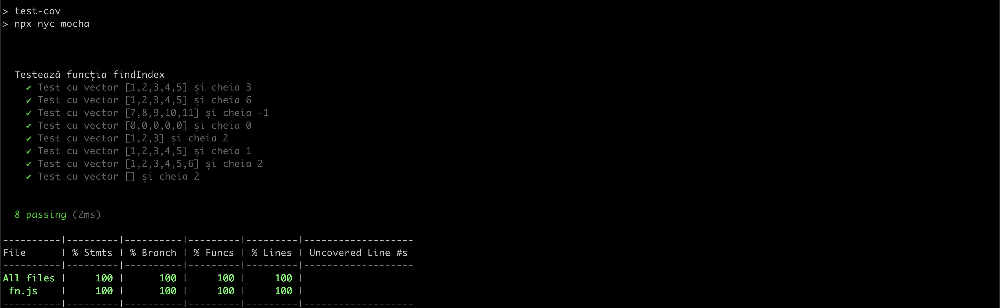

# Tema laborator Testarea Sistemelor Software

## Autor: Nicolae PLESCO

## Descriere

Limbajul folosit: **JavaScript (Node.js)**

### Tool-uri

- **Mocha**: pentru **testare**

- **NYC**: pentru **coverage**

- **Stryker**: pentru **testare a mutațiilor**

---

## CFG (Control Flow Graph)


[Code2Flow Link](https://app.code2flow.com/jkUR3zLmKUMI)

---

## Install

```bash
$ npm install
```

---

## Mutation Test

```bash
$ npm run test-mut # npx stryker run
```

### HTML
reports/mutation/mutation.html


### CLI


---

## Coverage Test

```bash
$ npm run test-cov # npx nyc mocha
```


